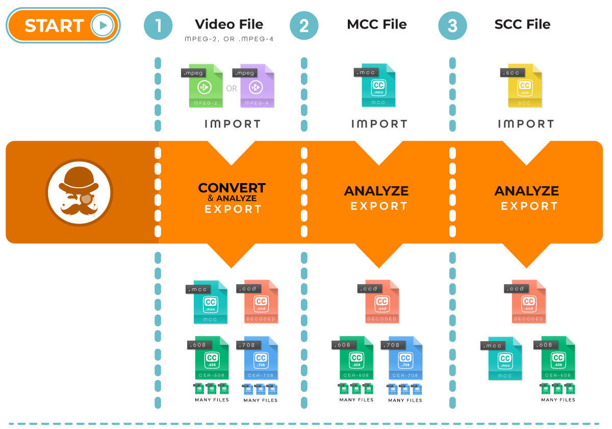

[](https://travis-ci.com/henrydtho/caption-inspector-2026)

Caption Inspector
=================

The Caption Inspector project builds a C library, C executable, and Docker image that can be used to extract and decode
Closed-Captions from various Video or Caption File Formats. Caption Inspector Supports CEA-608 and CEA-708 in MPEG-2 and
MPEG-4 (.mpg, .ts, and .mp4 containers), MCC (MacCaption Closed Captions), and SCC (Scenarist Closed Captions) files.



Caption Inspector has a plugin pipeline architecture that can be configured in various ways and allows the user to add
new plugins to perform various transformations. Currently, the following are the main use cases that the Caption
Inspector Software covers:
* Pulling Captions from a Video Asset and writing them to an MCC Caption File, a [CEA-608 Decode File](./docs/decoded608.md),
a [CEA-708 Decode File](./docs/decoded708.md), and a [Closed Caption Descriptor Decode File](./docs/decodeCCD.md).
* Decoding a MCC Caption file and writing the decoded captions into  a [CEA-608 Decode File](./docs/decoded608.md),
a [CEA-708 Decode File](./docs/decoded708.md), and a [Closed Caption Descriptor Decode File](./docs/decodeCCD.md).
* Decoding a SCC Caption file and writing the decoded captions into a MCC Caption File, a [CEA-608 Decode File](./docs/decoded608.md),
and a [Closed Caption Descriptor Decode File](./docs/decodeCCD.md).

Building and Running the Caption Inspector Executable Locally
-------------------------------------------------------------

Caption Inspector requires FFMPEG to be installed on your machine. Please download the appropriate
version of FFMPEG from [here](https://ffmpeg.org/download.html) and install it in your machine.
Caption Inspector is known to run with FFMPEG Version 4.0.2.

To install FFMPEG Version 4.0.2, follow the below list (for Mac), using the Dockerfile as a reference:
```
brew install nasm
brew install yasm
curl -s http://ffmpeg.org/releases/ffmpeg-4.0.2.tar.gz | tar zxvf - -C . 
cd ffmpeg-4.0.2/
./configure  --enable-version3 --enable-hardcoded-tables --enable-shared --enable-static --enable-small --enable-libass --enable-postproc --enable-avresample --enable-libfreetype --disable-lzma --enable-opencl --enable-pthreads
make
make install
make distclean
```

While not required, Caption Inspector leverages a tool called MediaInfo to determine whether or not
an asset is, or is not, Drop Frame. You can download the command line version of MediaInfo
[here](https://mediaarea.net/en/MediaInfo/Download). Caption Inspector is known to run with
MediaInfo Version 18.12 (found [here](https://mediaarea.net/download/binary/mediainfo/18.08/MediaInfo_CLI_18.08_Mac.dmg)).

```
make caption-inspector
./caption-inspector -h
./caption-inspector -o . test/media/BigBuckBunny_256x144-24fps.ts
./caption-inspector -o . test/media/Plan9fromOuterSpace.scc -f 2400
./caption-inspector -o . test/media/NightOfTheLivingDead.mcc
```

Running with the `-h` option will simply print out the help text. 

Running against the video file `BigBuckBunny_256x144-24fps.ts` demonstrates decoding closed captions from a video file.

Running against the caption file `Plan9fromOuterSpace.scc` demonstrates decoding an SCC file and CEA-608 Captions, as well as
converting the contents of the SCC file into an MCC file.

Running against the caption file `NightOfTheLivingDead.mcc` demonstrates decoding an MCC file, CEA-608 Captions, and CEA-708 Captions.

Building the Caption Inspector Executable Locally with MOV Support
------------------------------------------------------------------

Caption Inspector requires the inclusion of the [GPAC][https://gpac.wp.imt.fr/] Library. Specifically a modified library of GPAC which
gets linked as a shared object is required. This library is located [here][https://github.com/henrydtho/gpac-caption-extractor] and must be pulled and built.
Once the GPAC library has been built the same instructions are used as above.

```
git clone https://github.com/henrydtho/gpac-caption-extractor.git
cd gpac-caption-extractor
make install
cd ../caption-inspector
make ci_with_gpac
```

Building and Running Caption Inspector in a Docker Container
------------------------------------------------------------
Obviously you need docker running on your local machine to build. Building inside of a docker image will remove the need
to install any dependencies, but comes at the expense of a slightly more complicated command line execution. Another advantage
of building Caption Inspector inside of the Docker Container is that it seamlessly integrates MOV support. All of the steps above
to pull the GPAC library, build it, and then link it to Caption Inspector are done automagically in the Docker File.

```
make docker
docker run -t caption-inspector -h
docker run -tv $(pwd):/files caption-inspector -o /files /files/test/media/BigBuckBunny_256x144-24fps.ts
docker run -tv $(pwd):/files caption-inspector -o /files /files/test/media/Plan9fromOuterSpace.scc -f 2400
docker run -tv $(pwd):/files caption-inspector -o /files /files/test/media/NightOfTheLivingDead.mcc
```

In the `docker run` command, your current working directory will be remapped to `/files` inside of the container, so
you will need to prefix your input and output paths to that so that it can place the files in the correct spot. For
this example, the output file is located in the current directory `./` and the input file is located in a directory
underneath the current directory, specifically `./test/media/*`.

Regression Testing the Caption Inspector Executable
---------------------------------------------------

While the testing is not complete yet, there are several Unit Tests, Integration Tests, and System Tests that run
on the Caption Inspector Codebase. These are intended to be run as integration tests and verify that nothing has
broken as a result of a change. They are run as part of a pull request, but for debugging purposes they can also
be run locally (even in an IDE) before a pull request is issued. The easiest way to run these is inside of docker,
as the dependencies are handled for you. But if you need to run them with an IDE/debugger, they can also be run
from the command line. To run the regression tests from inside of docker, you can build the docker image and run
the tests from the root directory.

```
make docker-test
```

The output generated by this activity can give information about any test case that does not pass, but even more useful
is an HTML file that is the output of the test. It contains all of the tests, and their statuses. It is in the root
directory and takes the form `<date>__<time>_test_output.html`. To view the results you can open the file inside of
a browser.

To run the regression tests from the command line, you need to install Xunit Viewer, which can be found [here](https://github.com/lukejpreston/xunit-viewer).
Xunit Viewer is the application that takes the Xunit XML and converts it into a beautified HTML format. Once you have
Xunit Viewer installed, or if you ignore it, you just need to build and run the regression tests from the test directory.

```
cd test
make test
```

The tests are a mix of C and Python, depending on which made more sense for the specific test. The build system will
aggregate all of the results from the tests in both languages.

Leveraging the Caption Inspector Functionality from Python
----------------------------------------------------------
C was chosen as the language for Caption Inspector because of interoperability with FFMPEG and ease of implementation of
the specifications. While that choice made sense, there are lots of reasons to want to access this functionality as a
library from a higher level language than C. To that end Python bindings, using CTypes, were added to the C functionality
which can be compiled into a shared library and referenced from Python code. To use this functionality you just need
to build the shared library using the command `make sharedlib`. Then leverage the file `python/cshim.py` inside of your
Python code, making sure that it knows where to find the shared library with the Caption Inspector Code.

The Caption Inspector code that makes this possible, and the library it generates, can likely be reused for other high
level languages such as Java/JNI, Golang/Cgo, etc. No work has been done in those languages, but if you do end up using
it in a new language, please consider submitting the results back to the repository.

Local Caption Inspector App (v7.5)
----------------------------------

A desktop app is included at `python/caption_inspector_app.py` for inspecting decoded caption tracks with a file picker dialog and
an in-window test results pane. The launcher uses the existing Python shim and shared library and starts the desktop app
by default.

```
make app
```

The desktop app will build the shared library if needed and then open a local GUI with four tabs:

* **Inspect Captions** — a browse dialog for selecting supported files, a run-check button to execute the decode test,
and a results window that shows track events, transcript text, and decoder output. The frame rate is read from the file
rather than asked for.
* **Sync QC** — the A/V sync checker described below.
* **Compare Subtitles** — two files for the same episode, checked for validity and diffed against each other.
* **Transcript & Match** — converts a caption or subtitle file into a transcript and, when a video is supplied, marks
every line with its offset from the spoken dialogue.

Every tab has a **Stop** button. Tier 2 and the transcript builder stop within a second or two, killing any running
ffmpeg child; the decoder on the Inspect tab is a single blocking call into the C library, so Stop there returns the tab
immediately and discards the abandoned result rather than interrupting the decode itself. The status line says so.

On macOS, a root-level app bundle is also included at `Caption Inspector v7.5.app`. You can launch it from Finder like any
other app, or open it from the terminal with:

```
open "Caption Inspector v7.5.app"
```

That bundle carries its own copy of `python/` and the compiled `libci` library under `Contents/Resources/`, so it can be
copied anywhere - including `/Applications` - and run on its own; it does not need this working tree present. It still
runs on the Python and FFmpeg already on your machine rather than bundling its own, which is what makes it lightweight.
For a copy that needs nothing installed at all - its own Python, FFmpeg and speech model included - build the fully
self-contained bundle described under *Sending it to someone else* below.

If Homebrew or Python 3 are missing on first launch, the app now prompts you to install them and opens Terminal to run
the installer commands. After installation completes, click Retry in the prompt and launch will continue.

Previous releases are frozen under [`zDeprecated/`](./zDeprecated/README.md) and are no longer maintained.

### Comparing two subtitle files

Two versions of the same episode turn up and nobody can say what changed between them. The **Compare Subtitles** tab
takes both, checks each one on its own, and reports every way they differ. Differences are described as B relative to
A, so the approved version goes in A.

It runs three passes, in that order, because the later ones are meaningless if an earlier one fails:

**Validity**, on each file alone — cues that run backwards, overlap, clear before they appear, sit on screen for four
frames or for half a minute, run past 42 characters a line, or scroll faster than anyone reads. None of this needs the
other file, and all of it invalidates a diff.

**Alignment**, by text rather than by index. This is the part that decides whether the output is usable: positionally, a
single cue inserted at the head shifts every later cue by one and the whole programme reads as changed. Matching on
normalised text means one inserted cue reports as one addition.

**Timing**, across every pair that matched. A constant gap is an offset — usually a different start timecode or a
missing pre-roll. A gap that *grows* with position is drift, and the slope names the frame-rate pair that caused it
("consistent with the second file being timed against 25 fps but delivered at 23.976 fps"). A gap that grows but whose
cues do not sit on the line is neither: that is per-cue retiming, and it is reported as such rather than as a rate
error someone would go hunting for.

Differences are split by **what kind of change** they are, and the pane defaults to hiding the ones nobody asked about:

| Filter | Shows |
|---|---|
| Script changes only | Cues whose *words* changed |
| Script and timing | Script changes, retimed cues, additions and removals |
| Added and removed only | Cues present in one file and not the other |
| Everything | The above plus formatting-only changes |

That split exists because a file re-exported through another tool converts every apostrophe and ellipsis in the
programme. Those are real differences, but burying four script edits among two hundred smart-quote conversions is how a
diff stops being read. A cue whose normalised text is unchanged is reported as **formatting**; one whose words changed
is a **script change**, with an inline word-level diff.

The tab never asks for a frame rate, and a comparison works across formats. Checking an SRT delivery against the
approved TTML is the normal case, not a special one — and so is checking either of them against an **SCC**. The
broadcast formats go through the C decoder and arrive as the same cues as everything else, so `.scc`, `.mcc` and the
media containers (`.mov .mp4 .ts .mpg`, decoded from the embedded 608/708) can go in either box.

Two things are true of decoded captions and are reported rather than papered over:

**CEA-608 has no out-times.** Text clears on a later control code, not on a stamp of its own. The duration, overlap and
reading-rate checks say they were not run instead of passing vacuously — a clean bill of health from a test that never
executed is worse than no test.

**SCC and MCC stamp the tape, not the programme.** A file starting at `01:00:00:00` is an hour ahead of the SRT of the
same episode before anything is wrong. Rather than reporting every cue as retimed by an hour, the comparison works out
the file-wide offset first and measures each cue against *that* — so an SCC-against-SRT check shows the origin
difference once, names it as the tape origin, and then lists only the cues that genuinely depart from it. The same
mechanism absorbs a ten-second pre-roll difference between two SRTs.

### Reading the frame rate off the file

The app no longer asks which frame rate a file is in. It reads it, and says how it knows. There are three situations and
they are genuinely different:

**Declared.** TTML states `ttp:frameRate`, EBU-STL states it in the GSI Disk Format Code, MCC states `Time Code
Rate=30DF`. The value is read and reported as declared — and then checked against the file's own stamps, because a file
labelled 25 whose cues sit on a 29.97 grid is mislabelled, and that is the single most common reason a delivery drifts.
A disagreement is reported as a conflict rather than silently resolved.

**Counted.** SCC, MCC and Spruce STL stamp `HH:MM:SS:FF`. The frame field cannot reach the counting rate, so the highest
frame number in the file is a floor under it — a file using frame 29 is not 25 fps — and a `;` separator settles NTSC
drop-frame outright. Where two rates count identically (29.97 and 30, or 23.976 and 24) both are reported rather than
one being guessed at.

**Quantised.** SRT, WebVTT, ASS and the rest are wall-clock: seconds, with no frame rate anywhere in the format. But a
file converted from a frame-based master still has every stamp sitting on a frame boundary, and which boundary gives the
rate away. A 25 fps master leaves every cue on a multiple of 40 ms; a 29.97 master leaves them 33.367 ms apart, which no
other supported rate explains once the programme is long enough.

The last one is the useful trick, and it also has to be honest about failing. A file typed at whole seconds sits on the
24, 25, 30, 50 and 60 fps grids at once; a file generated at arbitrary millisecond times sits on none of them. Both are
reported as carrying no frame-rate evidence, because answering "25 fps" to either would be inventing a fact that then
gets acted on.

An explicit frame rate can still be chosen on the Inspect tab. It is needed for exactly one case — an SCC too short for
its highest frame number to mean anything — and the app says so when that happens instead of failing.

### Subtitle and caption formats

All three tabs accept the same set of files. The format is decided by reading the file, not by trusting its extension —
a `.xml` holding TTML, a `.vtt` holding SRT, a `.sub` that is MicroDVD rather than SubViewer, and a `.stl` that is binary
EBU rather than Spruce text are all things vendors ship, and each is identified by what is inside it.

| Format | Extensions | Notes |
|---|---|---|
| SubRip | `.srt` | |
| WebVTT | `.vtt` `.webvtt` | Cue settings, `NOTE`/`STYLE`/`REGION`, `<v Speaker>`, `X-TIMESTAMP-MAP` |
| TTML / DFXP / IMSC / iTT | `.ttml` `.dfxp` `.imsc` `.itt` `.xml` | `ttp:frameRate` with multiplier, nested `div`/`seq` timing, `ttm:agent` speakers |
| Advanced SubStation Alpha | `.ass` | Column order read from the `Format:` line; override and drawing blocks stripped |
| SubStation Alpha | `.ssa` | |
| SAMI | `.smi` `.sami` | Multi-language `<P Class=…>`; `&nbsp;`-only `SYNC` read as a clear |
| SubViewer | `.sub` | |
| MicroDVD | `.sub` | Frame-based; rate from its `{1}{1}25.000` pseudo-cue |
| YouTube SBV | `.sbv` | |
| MPL2 | `.mpl` | |
| LRC | `.lrc` | Enhanced per-word stamps stripped |
| RealText | `.rt` | |
| Spruce / DVD Studio Pro STL | `.stl` | Frame-based; `$FrameRate` when declared |
| EBU-STL | `.stl` | Binary. GSI + TTI blocks, ISO 6937 and the 8859 code tables, multi-block subtitles |
| Scenarist SCC | `.scc` | Decoded to CEA-608; frame rate read from its own timecodes |
| MacCaption MCC | `.mcc` | Decoded to CEA-608/708 |
| Media containers | `.mov` `.mp4` `.ts` `.mpg` | Embedded CEA-608/708 decoded out of the stream |

The Inspect Captions tab shows a subtitle file as a spotting list — in, out, speaker and text per cue — rather than as
608 control codes, because a subtitle file states both ends of a cue outright and has nothing to reconstruct.

**Two formats count frames rather than seconds**, and neither always says at what rate: MicroDVD and Spruce STL. When
the file declares no rate the app reads it at 25 and 30 respectively and records that the rate was assumed, shown in the
Decoder Output pane. Frames read at the wrong rate move every cue in the file, so it is worth checking there before
trusting a drift number from one of these.

**Program timecode.** SCC, MCC and both STL flavours stamp cues in absolute program timecode, so their times are rebased
against the video's start timecode before anything is compared. Everything else counts from the head of the program and
is left alone.

**Not supported:** the binary proprietary formats — Cheetah/CPC `.cap`, Screen Subtitling `.pac` and `.890`, Unipac
`.uni`. They have no published specification. The app names them and says to convert to SRT, STL or TTML rather than
reporting a corrupt file.

### What changed in v7.5

**SCC transport compliance audit, revised: one WARN downgraded to INFO, with a real cue-boundary bug fixed along the way.**
New fixture `maccaps_v3_working.scc` (confirmed working in Switch) has the `edm_eoc_combined_and_doubled` pattern on
every cue - the same pattern v7.0 flagged WARN on the strength of a 2-for-2 correlation with two failing test files. That
correlation is disproven: the trait now reports INFO, not WARN. `pac_count == 0` remains the one WARN check; every
working file has a position code on every cue, every failing file is missing one somewhere. `3play_failing.scc`'s actual
root cause is unresolved again - it has PAC on every cue, so that was never it either, and the previous (incorrect)
attribution to the EDM/EOC pattern is retracted rather than replaced with a new guess.

Fixing up the test suite for the new fixture surfaced a real bug in `scc_transport_audit.group_into_cue_blocks`: a
vendor encoder (MacCaption) resends RCL immediately before its erase sequence, which the old "any block with RCL starts
a new cue" rule mistook for the start of a new cue, splitting each of that file's 10 real cues into two. A block now has
to carry RCL *and* actual content (a PAC or caption text) to start a new cue.

### What changed in v7.0

**SCC transport compliance audit.** A new, independent capability for `.scc` files: `scc_raw_parser.py` reads the plain-text
`Scenarist_SCC V1.0` format directly, bypassing `libci`, so `scc_transport_audit.py` can see the raw, undeduped byte pairs -
whether a control code was sent once or doubled, and whether EDM and EOC were combined into the same block - detail that
does not survive as far as the decoded output the rest of the app uses. It reports which cues are missing a position code
(PAC/Tab Offset) and flags the specific doubled-and-combined EDM+EOC pattern this project's own player testing associated
with playback failure; everything else (doubling in general, a missing ENM) is informational, not a claimed defect. See
`test/python/test__scc_transport_audit.py` for the regression fixtures this is built against and what they do and do not
prove.

The **Delivery Compliance** section is appended automatically to a `.scc` file's exported PDF (*Export PDF* on the Inspect
Captions tab). `python/transport_compare.py` is a standalone CLI and `compare()` function for diffing the raw transport
structure of two `.scc` files cue by cue - the byte-level counterpart to `subtitle_compare.py`, which only compares cue
text and timing.

This only applies to `.scc` input; `.mcc` and container-embedded 608/708 have no transport-audit capability yet.

**Compare Subtitles can now compare a short SCC.** `.scc`, `.mcc` and TTML/SRT/WebVTT/etc. could already be compared
against each other - `.scc` was never actually limited to comparing against other `.scc` files. What did not work was a
delivery whose SCC states no frame rate and whose own timecodes are too sparse to infer one from (the same edge case the
Inspect tab's frame rate dropdown exists for): the comparison had no way to hand the decoder a rate, so it failed outright
instead of falling back. The Compare Subtitles tab now shows the same frame rate dropdown next to a `.scc` file, enabled
only when one is chosen; `compare_cli.py` gained matching `--rate-a`/`--rate-b` flags, and `compare_subtitles()` gained
`rate_code_a`/`rate_code_b` parameters. Everything else still just reads its own rate, unasked.

### What changed in v6.0

**Export the Inspect Captions results.** The Test Results pane on the Inspect Captions tab now has **Export Text** and
**Export PDF** buttons, so whatever is currently on screen - the timeline, the reconstructed visible cues, a subtitle
spotting list, or the raw debug view - can be saved as a `.txt` file or a paginated `.pdf` without retyping or a
screenshot.

**The app bundle is now relocatable.** `Caption Inspector v6.0.app` carries its own copy of `python/` and `libci` under
`Contents/Resources/`, so it can be copied to `/Applications` (or anywhere else) and launched from there without this
repository present. Previously it only ran from inside the working tree.

### What changed in v5.8

**New: the Compare Subtitles tab.** Two files for the same episode, checked for validity and diffed against each other,
with script changes separated from formatting-only ones and a timing analysis that tells an offset from drift from
per-cue retiming. It reads everything the app reads — including `.scc`, `.mcc` and captions decoded out of a media
container — so an SCC deliverable can be checked against the SRT of the same episode. `python/compare_cli.py` does the
same from the command line and exits `2` when the files differ. See *Comparing two subtitle files* above.

Timing is judged against how far apart the two files are overall rather than against zero, which is what makes an
SCC-against-SRT comparison readable: the hour of tape origin is reported once and named, not repeated as a fault on
every cue.

**The app no longer asks for a frame rate.** It reads it off the file and reports how it knows — declared, counted from
the timecode frame field, or inferred from the frame grid the stamps sit on. The `Frame rate x100` spinbox on the Inspect
tab is now a list defaulting to *Auto (read from the file)*, and the old advice to "use 2400 for SCC-style inputs" is
gone: an SCC's own timecodes say whether it is 29.97 drop-frame or 25, and now they are read.

This also catches a mislabel that nothing previously looked for. A TTML declaring `ttp:frameRate="25"` whose cues sit on
a 29.97 grid is now reported as a conflict on sight, in one file, without a video to compare against.

**Nine more subtitle formats**, and the frame-rate work applies to all of them — see *Subtitle and caption formats*.

### What changed in v5.7

**Fixed: the speaker label was printed twice.** `LAUREN: LAUREN: What, the Cheshire grapevine?`. v5 began extracting the
speaker into its own field but left it in the line text as well, and every renderer prints the field in front of the
text. The label is now removed from the text it was taken from.

**Fixed: lines the matcher never attempted were reported as "not found in audio".** Sound effects (`[cheering]`,
`[bell tings]`) and any cue under three words (`- Oh.`, `- Why?`) are declined by the aligner outright, so reporting them
as missing accused the caption file of a fault that was never tested for. On a real programme that was around 40% of the
lines, which made a good delivery look broken. They now read **"not dialogue"** or **"too short to match"**, are excluded
from the match rate, and no longer appear under the "needs attention" filter. The match rate is now *found over
testable*, not *found over every line*.

**Short lines are now matched from their neighbours.** A cue of one or two words — `"Yeah."`, `"- Oh."`, `"It's
massive."` — was skipped outright, because searching a whole transcript for "yeah" is meaningless. On a programme of
short reactions that left most lines unmatchable: 21 of 25 sampled lines from a real delivery were under the threshold.

A cue's position is not actually unknown, though — it is boxed in by the lines either side of it. So a third pass runs
after the main one and searches each short cue *only between its anchored neighbours*, at a higher confidence bar. The
ambiguity is resolved by context rather than by lowering the threshold: six cues all reading `"yeah"`, with six
occurrences in the audio, each take their own. A short cue whose word is not spoken is still left unmatched, and one
with no anchored neighbour is not guessed at.

On a fixture of six long lines interleaved with six one-word reactions, all six went from "not found in audio" to
matched.

**New: `python/inspect_splits.py`** shows why a caption's text was split into runs and what was joined back together —
for tracing a fragmented word like `"ph one"` to the exact control code that caused it.

### What changed in v5.5

**Fixed: the model picker offered models the machine did not have.** Choosing one ran the whole check and failed at the
last step, after the video had been probed and its audio extracted, with advice that did not say how.

The picker now shows what is actually installed — `base (bundled)`, `large-v3 (installed)`, `medium (not installed)` —
and a run is refused up front rather than after minutes of work. What it tells you depends on how you are running it: a
working tree is offered a one-line download (and a **Get model...** button), while a self-contained bundle is told how
to stage the weights into it, because a bundle deliberately will not download anything.

Adding a model to an existing bundle no longer means rebuilding it:

```
make stage-model MODEL=medium          # copies the weights in and re-seals the bundle
make offline-app MODELS=base,medium    # or build one that carries it from the start
```

A missing model also no longer costs you the transcript — the Transcript tab offers to build it from the caption file
alone, with the lines honestly marked "not checked".

Model sizes, for planning a bundle: tiny 78 MB, base 148 MB, small 500 MB, medium 1.5 GB, large-v3 2.9 GB.

### What changed in v5

**Fixed: caption lines that name their speaker were mis-timed.** The speaker-stripping pattern required a leading
`>>` or `-`, so `>> LAUREN:` was handled but a bare `LAUREN:` was not — and a bare label is what most files use.

Nobody says a speaker's name aloud, so the label never appears in the transcribed audio. Left in the text it took the
cue's first token slot, and the matcher anchored one word early, timing each cue from the word *before* its dialogue.
Offsets came back scattered and negative — their size set by the length of the preceding word and the pause before the
line — which reads as erratic sync error rather than a bug. Lines without a label measured correctly, so a good file
looked half in sync.

On identical audio, with two caption files differing only by `NAME:` prefixes:

| caption file | v4 | v5 |
|---|---|---|
| no speaker labels | +60 ms, 7 of 8 in tolerance | +60 ms, 7 of 8 |
| the same lines, labelled | **−8740 ms, 1 of 8** | **+60 ms, 7 of 8** |

The label is now recognised in every form caption files use (`LAUREN:`, `>> LAUREN:`, `- LAUREN:`, `MAN 2:`,
`Lauren:`), conservatively enough that dialogue containing a colon — "I'll tell you this: it's freezing" — is left
intact. The speaker is kept and shown in the transcript instead of being discarded. And as defence in depth, each cue
is now anchored on the first token that actually matches the audio rather than on the start of the matched window, so
any unmatched leading token — a sound-effect tag, a word the transcriber dropped — costs a word of precision instead of
throwing the cue onto unrelated audio.

### What changed in v4

**Text subtitle formats.** TTML (`.ttml .dfxp .itt .imsc`, and `.xml` when it holds TTML) is now read directly,
including `ttp:frameRate` with its multiplier, timing that nests through `div` and `seq` containers, all five TTML time
expression forms, and speakers from `ttm:agent`. WebVTT is parsed properly rather than through an SRT pattern — two-field
`MM:SS.mmm` stamps, `NOTE`/`STYLE`/`REGION` blocks, cue settings, entities, and `<v Speaker>` voice spans. The format is
decided by the file's content, not its extension.

**Transcript & Match tab.** Exports as timecoded text, reading prose, Markdown, CSV, JSON, HTML, SRT, or WebVTT, with a
filter for just the lines that need attention. `python/transcript_cli.py` does the same from the command line and exits
`2` when lines fall outside tolerance.

**Stop buttons** on all three tabs, with cancellation threaded through ffmpeg, transcription, and alignment. A stopped
run writes no transcript cache entry.

**A fully offline build.** `make offline-app` produces a bundle carrying its own Python, ffmpeg, dependencies and model
weights — see [`packaging/README.md`](packaging/README.md). It makes no network connections at any point.

**Fixed: the start-timecode correction was too broad.** v3 subtracted the video's start timecode from every caption
timeline. That is right for SCC and MCC, whose stamps are absolute program timecode, but wrong for WebVTT, TTML, SRT and
captions decoded out of a container — all of which are already measured from the head of the file. On a video starting at
`00:58:30:00`, v3 would have reported a correct WebVTT file as 3510 seconds out. v4 decides per caption source.

### What changed in v3

Tier 2 now normalises both timelines to the media file before it measures anything. Caption timecodes are absolute
program timecode; the transcriber stamps its words from the head of the file. On a delivery whose start timecode is
`00:58:30:00`, v2 subtracted those two directly and reported the 3510-second head as a constant offset of
`-3,509,975 ms`. v3 subtracts the video's start timecode — the same value Tier 1 already parses off the container —
from each caption timecode first, so the reported offset is the sync error and nothing else. Files that start at
`00:00:00:00` are unaffected.

A/V Sync QC
-----------

The Sync QC tab answers a different question than the decoder does: not "what do these captions say?" but "do these
captions actually line up with this video?". It is aimed at catching the common vendor delivery bug where a file is
timed against one frame rate and delivered labelled as another.

The check runs in two tiers.

**Tier 1 — timecode and frame rate math.** Seconds to run, no audio analysis, and it catches most vendor errors on its
own. It reads the video's duration and frame rate with `ffprobe`, parses the caption file's timecodes, and compares:

* frame rate declared by the caption file against the video's actual rate
* the last caption event against the end of the program, within a tolerance you set (default ±2 frames)
* the ratio of caption runtime to program runtime, matched against the known frame-rate mismatch ratios — a file timed
at 29.97 and delivered as 25 runs 1.1988x long, and that signature is reported by name
* 1-hour-start reference mismatches, monotonic timecode ordering, and captions that start outside the program

**Tier 2 — audio-verified sync.** Confirms real drift rather than duration math. Caption timecodes are first rebased
onto the media file's timeline by subtracting the video's start timecode, so a head-based master is not reported as a
constant offset. It then transcribes the dialogue locally
with [faster-whisper](https://github.com/SYSTRAN/faster-whisper) (no API cost), fuzzy-matches caption text to the
transcript, and regresses caption-to-audio offset against timeline position. A flat line near zero is in sync; a sloped
line is the drift signature of an uncorrected frame-rate mismatch, and the slope gives the actual rate error in ms per
minute. Tier 2 is optional — the panel offers to install faster-whisper on demand, and Tier 1 works without it.

Both tiers produce a plain-language report you can send to a vendor, as text, HTML, or JSON.

Tier 1 needs only FFMPEG, which Caption Inspector already requires.

Caption timecodes are rebased onto the media file's timeline before anything is compared, but only for the formats that
need it: SCC and MCC carry absolute program timecode, while WebVTT, TTML, SRT and captions decoded from a container are
already measured from the head of the file.

### Running offline

The app makes no network connections of its own. Tier 1 needs only ffprobe. Tier 2 needs faster-whisper and a model,
both of which can be staged once and then used with the network switched off — set `HF_HUB_OFFLINE=1` to stop
huggingface_hub attempting a lookup it does not need.

For a build that can never reach the network, `make offline-app` bundles the interpreter, ffmpeg, the Python
dependencies and the model weights into the `.app` itself, and `make verify-offline-app` proves it:
see [`packaging/README.md`](packaging/README.md).

### Sending it to someone else

```
make offline-app    # a ~435 MB .app carrying its own Python, FFmpeg and speech model
make dist           # verify it, then write a DMG, a zip and checksums to packaging/dist/
```

The result runs on a Mac with no Homebrew, no Python and no network. It is relocatable — install it anywhere — and the
DMG and zip have both been round-tripped and re-verified, including a full Tier 1 + Tier 2 + transcript pass from the
unpacked copy.

Two things to know before you send it:

* **A build only runs on the architecture that built it.** Homebrew's FFmpeg and pip's wheels are single-architecture,
so an Apple Silicon build will not run on an Intel Mac. To ship both, run `make offline-app` on a Mac of each type; the
artifacts are named with their architecture. The app checks this at startup and says so plainly rather than failing
cryptically.
* **Without an Apple Developer ID the recipient has to clear the quarantine flag once**, with a single command that
ships alongside the DMG in `FIRST-LAUNCH.txt`. If you have a Developer ID, `make dist SIGN_IDENTITY=... NOTARY_PROFILE=...`
signs and notarizes so it opens with no ceremony at all.

### Command line

For batch checking deliveries, use `python/sync_cli.py`:

```
python3 python/sync_cli.py <video> <captions>
```

It exits `0` on PASS and `2` on FAIL, so it drops straight into a delivery gate. Useful flags:

* `--tier2` runs the audio verification when Tier 1 passes; `--tier2-always` runs it regardless
* `--rate` overrides the assumed caption frame rate instead of auto-detecting it
* `--tolerance-frames` / `--tolerance-ms` set the Tier 1 and Tier 2 pass bars
* `--report FILE` with `--format {text,html,json}` writes the vendor-facing report
* `--captions-only` checks the caption file's internal consistency when you have no video to hand

For transcripts, use `python/transcript_cli.py`:

```
python3 python/transcript_cli.py program.ttml --video program.mov -o transcript.html
```

It writes text, Markdown, CSV, JSON, HTML, SRT, or WebVTT — chosen from the output extension or forced with `--format` —
and exits `0` when every line is inside tolerance, `2` when any line is outside it or missing from the audio. Without
`--video` it just converts the file and says the match was not checked.

To compare two subtitle files, use `python/compare_cli.py`:

```
python3 python/compare_cli.py approved.srt delivered.srt -o diff.html
```

Differences are described as the second file relative to the first, so the approved version goes first. It exits `0`
when the two files are equivalent and `2` when they differ. `--frame-rate` skips the comparison and just reports what
frame rate each file is in:

```
python3 python/compare_cli.py program.scc --frame-rate
```

```
python3 python/sync_cli.py program.mp4 program.scc --tier2 --report drift.html --format html
```

Windows Desktop App (One-Click Setup)
-------------------------------------

For non-technical users on Windows, use the bundled launcher script:

1. Open the repository folder.
2. Double-click `windows/Launch-CaptionInspector-Windows.cmd`.
3. Accept the Administrator prompt.

The script will automatically:

* install Python 3 (via `winget`) if missing
* install MSYS2 (via `winget`) if missing
* install compiler + ffmpeg build dependencies in MSYS2
* build the Caption Inspector Windows shared library (`python/libci.1.0.0.dll`)
* install Python app dependencies
* launch the desktop app

If `winget` is unavailable, the launcher now falls back to direct installers from python.org and the official MSYS2
GitHub release page.

For restricted networks, an offline installer cache is supported. Place these installers in
`windows/installers/`:

* `python-3.12.10-amd64.exe`
* `msys2-x86_64-latest.exe`

Then run:

```
windows\Launch-CaptionInspector-Windows.cmd -OfflineOnly
```

Offline mode skips winget and web downloads, but the MSYS2 build packages (`clang`, `make`, `pkg-config`, `ffmpeg`)
must already be installed in MSYS2.

The setup also attempts an optional Homebrew install inside WSL when available. If WSL/Homebrew cannot be configured,
the app setup still continues because Homebrew is not required for native Windows execution.

You can also validate the launcher without starting the UI:

```
make app-check
```

Windows Streamlit Web App (One-Click Setup)
--------------------------------------------

To run the browser-based Streamlit UI natively on Windows instead of the desktop app, double-click
`windows/Launch-CaptionInspector-Streamlit-Windows.cmd`. It runs the same bootstrap as the desktop launcher (Python,
MSYS2, compiler/ffmpeg build deps, the `libci.1.0.0.dll` shared library, and `python/requirements-app.txt`), then opens
`python/app.py` with Streamlit at `http://localhost:8501` in your default browser. Tkinter is not required for this path.

It also supports `-OfflineOnly` with the same installer cache under `windows/installers/` described below, and any
extra arguments after the script name are passed straight through to Streamlit, e.g.:

```
windows\Launch-CaptionInspector-Streamlit-Windows.cmd -- --server.port 8888
```

A web app remains available at `python/app.py` if you prefer the browser workflow. Install the dependency first and then
launch it with:

```
make sharedlib
python3 -m pip install -r python/requirements-app.txt
make web-app
```

The app will detect the shared library in the `python/` directory automatically. If you need to point it at a different
build, set the environment variable `CAPTION_INSPECTOR_LIBRARY` before starting Streamlit.
